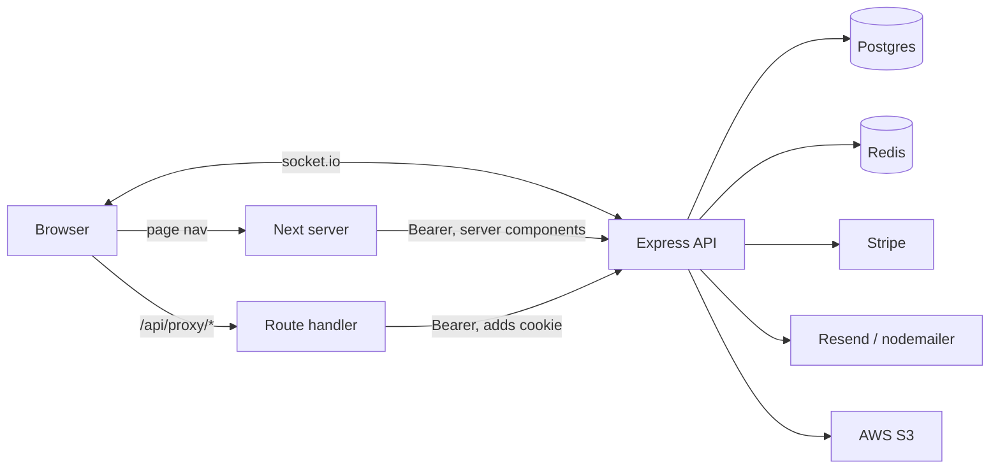

# FoxPassport — architecture

As built, 2 Sep 2026, on `fix/socket-emit-gaps` in both repos.
Written from the code, not from intent.

## Two repos, one system

| | `fox-passport-republic-api` | `fox-passport-republic-app` |
|---|---|---|
| Stack | Express 4 + TypeScript, Prisma 7, Postgres | Next 16 (App Router), React 19, TypeScript |
| Port | 6002, everything under `/api/v1` | 6001 |
| Owns | data, auth, authorization, money, mail | rendering, session cookies, realtime client |
| Tests | vitest, 146 | vitest + testing-library, 94 |

The API is the only authority on who may do what. The app holds no signing key
and cannot mint a token — it verifies nothing and asks.

## Runtime topology



Redis is optional-ish: the client logs and continues without it, but socket
tickets cannot be issued, so realtime falls back to a 60s poll.

## Three ways data reaches a screen

1. **Server components** — `getServerApi()` (`shared/lib/server/data.ts`) reads
   the `fox_token` cookie directly and calls the API with a Bearer header.
   Used by page-level guards and initial data.
2. **Client fetches** — axios → `/api/proxy/[...path]` (a Next Route Handler)
   → API. The proxy reads the httpOnly cookie server-side and attaches the
   header, so the token never touches client JavaScript. It also handles
   401 → refresh → replay, and dedupes concurrent refreshes in a process-local
   `inFlight` map because refresh tokens are single-use.
3. **Socket push** — the API emits, the client invalidates, React Query refetches
   through path 2. The socket carries no data of its own.

## Auth

Cookies, all set by `shared/lib/server/auth-actions.ts`:

| Cookie | httpOnly | Holds |
|---|---|---|
| `fox_token` | yes | access JWT (HS256) |
| `fox_refresh_token` | yes | refresh token, rotated on use |
| `fox_user` | no | display data only — never proof of anything |

Sign-in paths: password, and Google (an exchange code, because the API cannot
set cookies for the app's origin). Password change and reset revoke all
sessions; Google sign-in does not yet.

**The app holds no `ACCESS_TOKEN_SECRET`.** `middleware.ts` used to verify the
JWT, which meant a copy of the API's HS256 key lived here — and HS256 is
symmetric, so that key could also sign. It now checks only that `fox_token`
exists. RS256/ES256 is the path if edge verification is ever wanted back.

## Authorization — three layers, one authority

```
middleware.ts        cookie present?              UX redirect. Fools easily. Not a boundary.
layout / page        requireAuth / requireAdmin   live /profile call, redirects before render
API route            authenticate + requirePermission   the actual boundary: 401 / 403
```

Two independent role axes on `User`:

- **`SystemRole`** — `user`, `admin_secretary`, `admin`. Runs through the
  permission table below.
- **`RoleType[]`** — `venueFoxer`, `eventFoxer`, `gearFoxer`, `serviceFoxer`,
  `investor`. The supply side, granted through role applications. It has **no**
  grant table; it is still checked by role name through `requireRole`.

## RBAC — how it is actually implemented

**One table, in one file.** `api/src/types/permissions.ts`:

```ts
export const PERMISSIONS = [
  "admin:access", "queue:read", "queue:decide",
  "users:read", "roles:manage", "categories:manage", "bookings:read:all",
] as const;

const GRANTS: Record<SystemRole, readonly Permission[]> = {
  user: [],
  admin_secretary: ["admin:access", "queue:read", "queue:decide"],
  admin: [ ...all seven... ],
};

export function can(role: string | null | undefined, p: Permission): boolean
export function permissionsFor(role: string | null | undefined): Permission[]
```

Typed `Record<SystemRole, …>` on purpose: a fourth role added to the Prisma enum
**fails to compile** until it is granted something, or explicitly nothing. `can()`
takes a plain string because roles arrive from JWT claims, and answers `false`
for anything it does not recognise.

This replaced 26 hand-written `systemRole === "admin"` comparisons across both
repos.

**Where it is applied, in order of authority:**

1. **Route guards** — `requirePermission(p)` in `auth.middleware.ts`: 401 if
   unauthenticated, 403 if `!can(req.user.systemRole, p)`. 21 registrations in
   `admin.routes.ts` gate on a capability; 14 still gate on the role through the
   deprecated `requireAdmin` (bookings, disputes, refunds) — the safe default for
   a new role, since `requireAdmin` excludes `admin_secretary` by design.
2. **Socket rooms** — the gateway joins `role:admin` only if
   `can(socket.systemRole, "queue:read")`. Same table, so a role that cannot read
   the queues never receives `admin:pending`.
3. **Page guards** — `requireAdmin()` in `app/src/shared/lib/server/auth.ts`
   calls `canAccessAdmin(user)` on a **live `/profile` fetch**, not on a cookie
   claim, so a role changed after sign-in takes effect on the next page load.
4. **UI** — every item in `AdminSidebar.NAV_ITEMS` declares the permission it
   needs (`satisfies` keeps that typed) and is filtered by `hasPermission`. A
   secretary sees Dashboard, Events, Venues, Assets, Services and nothing else.
   Hiding is courtesy; the API refuses those routes regardless.

**How the client knows.** Access tokens carry a `permissions` claim, stamped at
sign-in, refresh and Google exchange with `permissionsFor(user.systemRole)`
(`auth.service.ts:89,172,273`, `google-auth.service.ts:146`). The app mirrors
the grant table in `app/src/shared/lib/permissions.ts`, and `hasPermission()`
prefers the user's own claim when present, falling back to the table for a
profile fetched before the claim existed.

**The API never trusts that claim.** `toAuthenticatedUser` (`api/src/types/auth.ts`)
validates the verified payload and keeps only `userId`, `email`, `systemRole`
and `roleType` — the `permissions` array is dropped on the way in, and every
server-side decision re-derives from the role through `can()`. An unknown role
narrows to `user`, which grants nothing.

So the client copy can only ever be *wrong in the harmless direction*: it shows
a button that then 403s. It cannot grant anything.

Pinned by `api/tests/permissions.spec.ts` and
`app/src/__tests__/data/permissions.test.ts` — including that the converted
gates no longer compare `systemRole` to a literal, and that every nav item
declares a permission.

## Realtime

- **Handshake**: `POST /auth/socket-ticket` mints a 60s single-use ticket in
  Redis; the client presents it. `auth` is passed to socket.io as a *function*,
  so each reconnect fetches a fresh ticket.
- **Rooms**: `userId` (private) and `role:admin` (shared approval state).
- **Events**: `new_notification` (carries the notification) and `data:invalidate`
  (carries a topic and nothing else).
- **Topics** → React Query keys, mapped in `app/src/shared/lib/realtime.ts`:

| Topic | Invalidates |
|---|---|
| `admin:pending` | `admin-data` |
| `venues` | `host-venues`, `host-venue-stats`, `host-data` |
| `events` | `user-upcoming-events`, `host-data`, `admin-data` |
| `bookings` | `host-data`, `user-upcoming-events`, `admin-data`, `user-bookings` |
| `disputes` | `admin/disputes` (prefix — covers the per-type tables) |
| `waitlist` | `waitlist` |
| `roles` | `me` |

Names live in `api/src/infrastructure/socket/socket.constants.ts`, mirrored in
`realtime.ts` and pinned by tests — a typo on either side fails silently.
Polling is the recovery path only: one shared 60s `pollWhileVisible`.

## API internals

```
routes/       thin: path → middleware → controller
controllers/  HTTP shape, validation (Joi), announce socket topics
services/     business rules, money, payouts, notifications
repositories/ Prisma access
modules/      self-contained: notifications (own controller/service/repo)
infrastructure/socket/  server, gateway, constants, types, invalidate helpers
```

Emits are best-effort and wrapped — `invalidate.ts` swallows socket failures so
a write that succeeded is never failed by an announcement that did not.

## App internals

```
src/app/         App Router. (main) group, admin, booking, checkout,
                 creator-dashboard, foxer, mayor, reviews, user …
                 api/proxy/[...path] — the authenticated pass-through
src/features/    20 features, each with components/hooks/api/store
src/shared/lib/  axios, socket, realtime, permissions, server/{auth,data,auth-actions}
src/shared/providers/  Query → AuthStore → Socket, mounted in app/layout.tsx
```

State: React Query for server data, Zustand for auth and notifications.
Global query defaults: `staleTime: 30s`, no refetch on window focus.

## Data

41 Prisma models on Postgres. The spine:

- **People** — `User`, `RoleRequest`, five `*Application` models, `Passport`,
  `Badge`, `PassportStamp`, `FoxerSpecialization`
- **Supply** — `Venue`, `Asset`, `Service`, `EventTemplate` (+ its three join
  tables), `CancellationPolicy` / `CancellationRule`
- **Demand** — `Event` (+ three transaction tables), `Booking`,
  `BookingAttendee`, `AssetBooking`, `ServiceBooking`, `Waitlist`
- **Money** — `Payment`, `Payout`, `Refund`, `StripeEvent`
- **Social** — `Review`, `ReviewReply`, `Favorite`, `Notification`

Totals are always server-computed, never accepted from the client
(`docs/adr/0001`). Payouts go through Stripe Connect (`docs/adr/0002`).

## External services

Stripe (payments + Connect payouts; the webhook is mounted with a raw body
parser *before* `express.json`), Resend / nodemailer with Handlebars templates,
AWS S3 for uploads, Redis for socket tickets, Mapbox and Cesium in the client.

## Where this is fragile

- Nothing in the realtime path has been verified in a browser
  (`TOMORROW.md` §3d.5). A dead socket and a quiet one look identical.
- `PROTECTED_ROUTES` is opt-in and has drifted: seven trees, ~20 pages, sit
  outside both it and any guard (§7).
- Approve/reject exists twice — `/admin/*` and the resource-level routes. Only
  the first is used by this app, and they have already diverged once.
- `extractList()` guesses between eight response envelope keys, which fails
  silently and looks like empty data (§4).
