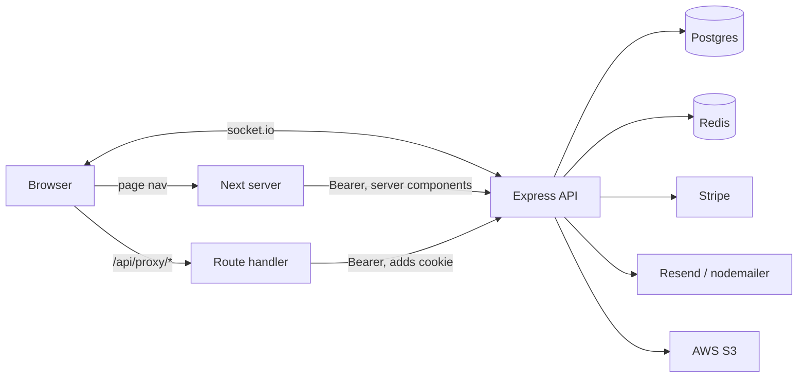

# FoxPassport — architecture

As built, 2 Sep 2026; auth revised 7 Sep on the AUTH-02/03 branches.
Written from the code, not from intent.

Auth is moving. `AUTH_HARDENING.md` tracks what is open and what was decided
against; this file describes the system as it stands.

## Two repos, one system

| | `fox-passport-republic-api` | `fox-passport-republic-app` |
|---|---|---|
| Stack | Express 4 + TypeScript, Prisma 7, Postgres | Next 16 (App Router), React 19, TypeScript |
| Port | 6002, everything under `/api/v1` | 6001 |
| Owns | data, auth, authorization, money, mail, **session cookie policy** | rendering, cookie **relay**, realtime client |
| Tests | vitest, 380 (re-measured 12 Sep; was 227) | vitest + testing-library, 144 (re-measured 12 Sep; was 132) |

The API is the only authority on who may do what. The app holds no signing key
and cannot mint a token — it verifies nothing and asks.

## Runtime topology



Redis is optional-ish: the client logs and continues without it, but socket
tickets cannot be issued, so realtime falls back to a 60s poll.

## Three ways data reaches a screen

1. **Server components** — `getServerApi()` (`shared/lib/server/data.ts`) reads
   the `fox_token` cookie directly and calls the API with a Bearer header.
   Used by page-level guards and initial data.
2. **Client fetches** — axios → `/api/proxy/[...path]` (a Next Route Handler)
   → API. The proxy reads the httpOnly cookie server-side and attaches the
   header, so the token never touches client JavaScript. It also handles
   401 → refresh → replay, and dedupes concurrent refreshes in a process-local
   `inFlight` map because refresh tokens are single-use. It also **relays the
   API's `Set-Cookie` headers** — with `getSetCookie()`, one header per cookie,
   since folding them into a comma-joined value produces something no browser
   can parse.
3. **Socket push** — the API emits, the client invalidates, React Query refetches
   through path 2. The socket carries no data of its own.

## Auth

Cookies, all defined and emitted by the API
(`modules/auth/auth.cookies.ts`), relayed to the browser by the proxy:

| Cookie | httpOnly | Holds |
|---|---|---|
| `fox_token` | yes | access JWT (HS256) |
| `fox_refresh_token` | yes | refresh token, rotated on use |
| `fox_user` | no | display data only — never proof of anything |

**Revised 7 Sep (AUTH-03).** The app used to compose these in
`shared/lib/server/auth-actions.ts`, with a `SESSION_MAX_AGE` written out three
times and kept equal by hand to `REFRESH_TOKEN_EXPIRY` in the API's environment.
They drifted once: the access cookie lived seven days while the JWT inside it
expired in fifteen minutes. Lifetime, flags and names are now decided in one
place and derive from `refreshTokenTtlMs()`, the same function that sets the
token's own expiry.

**The API sets no `Domain`, deliberately.** The browser never talks to it — it
talks to this app, whose proxy relays the headers onward — and a host-only cookie
binds to whoever relayed it. That is the assumption the arrangement rests on, and
it is the first thing to break if a direct browser-to-API call is ever added.
There is a test on it rather than a comment.

`clearAuthCookies` is the one exception still on the app side, and stays that
way: logout needs the httpOnly refresh token to revoke it, which the Next server
can read and the browser cannot. Relaying it would mean the API reading cookies.

**Session end is one function, `endSession()` (`shared/auth/endSession.ts`),
landed 12 Sep merging `feat/auth-03-api-cookies` into `main`.** It calls
`clearAuthCookies()` (non-blocking — never awaited past a `.catch`, since the
cookies are gone either way and the caller navigates immediately after) then
`useAuthStore.getState().logout()`, replacing four separate hand-written
clear-then-logout sequences that used to disagree — the axios 401 interceptor
was the one that never cleared cookies at all. Its two callers:

- `useLogout()` takes `{ promptLogin?: boolean }` (default `true`) — account
  deletion passes `false` since there is nothing left to sign back into.
- `AuthStoreProvider`'s idle-timeout `SessionManager` calls it, then hard-
  navigates to `/?auth=expired` rather than a bare `/`, which
  `SessionExpiredToast` (mounted globally) picks up on load to reopen the
  login modal with an explanation. `middleware.ts` uses the sibling
  `?auth=required` for a guard-triggered redirect, same toast, different
  copy.

Sign-in paths: password and Google, both through `/api/proxy/*` since 7 Sep
(AUTH-02) — nothing browser-side calls the API directly for an authenticated
concern any more. Google still crosses back with a single-use exchange code
rather than tokens. Password change, password reset and admin role assignment
revoke all sessions; **Google sign-in does not yet** (AUTH-05).

An explicit refresh — "sync my account" after a role changes — cannot carry its
own token, since it is httpOnly. The proxy holds it and fills the body in, so the
browser can ask for a refresh without ever seeing the credential that performs
it.

Rate limits sit on every credential endpoint, on two axes — per IP for stuffing,
per account for a distributed brute force — and stay enabled in development. See
`AUTH_HARDENING.md`.

**The app holds no `ACCESS_TOKEN_SECRET`.** `middleware.ts` used to verify the
JWT, which meant a copy of the API's HS256 key lived here — and HS256 is
symmetric, so that key could also sign. It now checks only that `fox_token`
exists. RS256/ES256 is the path if edge verification is ever wanted back.

## Authorization — three layers, one authority

```
middleware.ts        cookie present?              UX redirect. Fools easily. Not a boundary.
layout / page        requireAuth / requireAdmin   live /profile call, redirects before render
API route            authenticate + requirePermission   the actual boundary: 401 / 403
```

Two independent role axes on `User`:

- **`SystemRole`** — `user`, `admin_secretary`, `admin`. Runs through the
  permission table below.
- **`RoleType[]`** — `venueFoxer`, `eventFoxer`, `gearFoxer`, `serviceFoxer`,
  `investor`. The supply side, granted through role applications. RoleType
  grants are merged with SystemRole grants by `permissionsForUser()`.

The platform is one community ecosystem, not separate marketplaces. A person
may remain a Citizen while holding several capabilities at once. Capability,
ownership, and event participation are separate concepts and must not be
inferred from one another.

## RBAC — how it is actually implemented

**The grant tables are centralized in one file.** `api/src/types/permissions.ts`.
**Re-verified 12 Sep: `PERMISSIONS` has grown to 19 entries** (role assignment
and `admin_secretary`'s boundary added several after this was first written)
and `admin`'s grant is 14 of them, not seven:

```ts
export const PERMISSIONS = [
  "admin:access", "queue:read", "queue:decide",
  "users:read", "users:manage", "roles:manage", "roles:assign",
  "categories:manage", "policies:manage", "bookings:read:all",
  "payments:read:all", "disputes:resolve", "refunds:manage",
  // supply side, below
  "venue:manage", "asset:manage", "service:manage", "template:manage",
  "booking:check-in", "payouts:onboard",
] as const;

const GRANTS: Record<SystemRole, readonly Permission[]> = {
  user: [],
  admin_secretary: ["admin:access", "queue:read", "queue:decide"],
  admin: [
    "admin:access", "queue:read", "queue:decide", "users:read",
    "users:manage", "roles:manage", "roles:assign", "categories:manage",
    "policies:manage", "bookings:read:all", "payments:read:all",
    "disputes:resolve", "refunds:manage",
    "booking:check-in", // the one supply-side permission admin holds
  ],
};

const ROLE_TYPE_GRANTS: Record<RoleType, readonly Permission[]> = {
  venueFoxer: ["venue:manage", "payouts:onboard"],
  eventFoxer: ["template:manage", "booking:check-in", "payouts:onboard"],
  gearFoxer: ["asset:manage", "payouts:onboard"],
  serviceFoxer: ["service:manage", "payouts:onboard"],
  investor: [],
};

export function can(subject: AuthorizationSubject, p: Permission): boolean
export function permissionsForUser(subject: AuthorizationSubject): Permission[]
```

Typed `Record<SystemRole, …>` on purpose: a fourth role added to the Prisma enum
**fails to compile** until it is granted something, or explicitly nothing. `can()`
takes a plain string because roles arrive from JWT claims, and answers `false`
for anything it does not recognise.

This replaced 26 hand-written `systemRole === "admin"` comparisons across both
repos.

**Where it is applied, in order of authority:**

1. **Route guards** — `requirePermission(p)` in `auth.middleware.ts`: 401 if
   unauthenticated, 403 if `!can(req.user.systemRole, p)`. **Re-verified 12 Sep:
   this migration finished** — all 36 registrations in `admin.routes.ts` gate on
   a capability now; `requireAdmin` appears zero times in that file (was 14,
   including bookings/disputes/refunds, when this was written). `requireAdmin`,
   `requireRole` and `requireHost` are still *defined* in `auth.middleware.ts`
   but have no remaining call sites anywhere in `src/modules/*/*.routes.ts` —
   dead code, not yet deleted. See `RBAC-PLAN.md` §3 for that cleanup.
2. **Socket rooms** — the gateway joins `role:admin` only if
   `can(socket.systemRole, "queue:read")`. Same table, so a role that cannot read
   the queues never receives `admin:pending`.
3. **Page guards** — `requireAdmin()` in `app/src/shared/lib/server/auth.ts`
   calls `canAccessAdmin(user)` on a **live `/profile` fetch**, not on a cookie
   claim, so a role changed after sign-in takes effect on the next page load.
4. **UI** — every item in `AdminSidebar.NAV_ITEMS` declares the permission it
   needs (`satisfies` keeps that typed) and is filtered by `hasPermission`. A
   secretary sees Dashboard, Events, Venues, Assets, Services and nothing else.
   Hiding is courtesy; the API refuses those routes regardless.

**How the client knows.** Access tokens and profile responses carry a
server-derived `permissions` claim, stamped at sign-in, refresh, and Google
exchange with `permissionsForUser(user)`. The app mirrors the permission names
in `app/src/shared/constants/permissions.ts`; `hasPermission()` checks the
permissions carried by the current user and never invents a grant from a role
name.

**The API never trusts that claim.** `toAuthenticatedUser` (`api/src/types/auth.ts`)
validates the verified payload and keeps only `userId`, `email`, `systemRole`
and `roleType` — the `permissions` array is dropped on the way in, and every
server-side decision re-derives from the role through `can()`. An unknown role
narrows to `user`, which grants nothing.

So the client copy can only ever be *wrong in the harmless direction*: it shows
a button that then 403s. It cannot grant anything.

Pinned by `api/tests/permissions.spec.ts` and
`app/src/__tests__/data/permissions.test.ts` — including that the converted
gates no longer compare `systemRole` to a literal, and that every nav item
declares a permission.

## Realtime

- **Handshake**: `POST /auth/socket-ticket` mints a 60s single-use ticket in
  Redis; the client presents it. `auth` is passed to socket.io as a *function*,
  so each reconnect fetches a fresh ticket.
- **Rooms**: `userId` (private) and `role:admin` (shared approval state).
- **Events**: `new_notification` (carries the notification) and `data:invalidate`
  (carries a topic and nothing else).
- **Topics** → React Query keys, mapped in `app/src/shared/lib/realtime.ts`:

| Topic | Invalidates |
|---|---|
| `admin:pending` | `admin-data` |
| `venues` | `host-venues`, `host-venue-stats`, `host-data` |
| `events` | `user-upcoming-events`, `host-data`, `admin-data` |
| `bookings` | `host-data`, `user-upcoming-events`, `admin-data`, `user-bookings` |
| `disputes` | `admin/disputes` (prefix — covers the per-type tables) |
| `waitlist` | `waitlist` |
| `roles` | `me` |

Names live in `api/src/infrastructure/socket/socket.constants.ts`, mirrored in
`realtime.ts` and pinned by tests — a typo on either side fails silently.
Polling is the recovery path only: one shared 60s `pollWhileVisible`.

## API internals

```
routes/       thin: path → middleware → controller
controllers/  HTTP shape, validation (Joi), announce socket topics
services/     business rules, money, payouts, notifications
repositories/ Prisma access
modules/      self-contained: notifications (own controller/service/repo)
infrastructure/socket/  server, gateway, constants, types, invalidate helpers
```

Emits are best-effort and wrapped — `invalidate.ts` swallows socket failures so
a write that succeeded is never failed by an announcement that did not.

## App internals

```
src/app/         App Router. (main) group, admin, booking, checkout,
                 creator-dashboard, foxer, mayor, reviews, user …
                 api/proxy/[...path] — the authenticated pass-through
src/features/    25 features, each with components/hooks/api/store (was 20)
src/shared/lib/  axios, socket, realtime, permissions, server/{auth,data,auth-actions}
src/shared/providers/  Query → AuthStore → Socket, mounted in app/layout.tsx
```

State: React Query for server data, Zustand for auth and notifications.
Global query defaults: `staleTime: 30s`, no refetch on window focus.

## Data

**59 Prisma models on Postgres** (re-counted 12 Sep; was 41 when this was
written). The spine, plus three domains that landed after and were never
folded in:

- **People** — `User`, `RoleRequest`, five `*Application` models, `Passport`,
  `Badge`, `PassportStamp`, `FoxerSpecialization`
- **Supply** — `Venue`, `Asset`, `Service`, `EventTemplate` (+ its three join
  tables), `CancellationPolicy` / `CancellationRule`
- **Demand** — `Event` (+ three transaction tables), `Booking`,
  `BookingAttendee`, `AssetBooking`, `ServiceBooking`, `Waitlist`
- **Money** — `Payment`, `Payout`, `Refund`, `StripeEvent`
- **Social** — `Review`, `ReviewReply`, `Favorite`, `Notification`
- **Republic feed** (`prisma/schema/feed.prisma`) — `Post` and friends, added
  by the work `REPUBLIC_FOXER_SPEC_AND_CHECKLIST.md` tracked
- **Investments** (`prisma/schema/investment.prisma`) — `PartnerInvestment`
  and friends, same source
- **Messaging** (`prisma/schema/messaging.prisma`) — `Conversation`,
  `Message` and friends; see `GOTCHAS.md` #11 in the api repo for a migration
  bug found in this domain on 12 Sep

## Product Domain Model

Fox Passport Republic is a community-powered event ecosystem and marketplace.
The core relationship is:

```text
Person
  -> Citizen capability
  -> optional Event/Venue/Gear/Service Foxer capabilities
  -> optional Investor capability
```

An Event Foxer orchestrates an event but does not automatically own every
resource involved. The system must distinguish:

```text
Capability != Ownership != Participation
```

An EventTemplate is a reusable event design. An Event is a concrete occurrence
created from that design and records the actual date, location, resources,
providers, participants, bookings, and transactions. One template may produce
many events with different arrangements.

The foundational event rule is:

```text
Event location = required
Venue Foxer = optional
```

Locations may be marketplace venues, public places, private or external venues,
organizer-owned locations, or custom locations. Gear and Service Foxers are
optional contributors. An Event Foxer may use their own resources without
creating artificial marketplace transactions with themselves.

Ownership remains separate from participation: owning a venue, asset, or
service does not make a person the Event Foxer, and participating in an event
does not grant ownership or edit permission.

Investment and support are separate from ordinary booking and payment flows.
Real-money investment requires its own legal, compliance, financial, and
authorization domain; it must not be represented by overloading `Booking`,
`Payment`, or `Payout`.

## Product Implementation Direction

The architecture is refined in this order:

1. **Done.** Fix frontend creator-dashboard gates to use server-derived
  permissions so Gear Foxers see asset tools and Service Foxers see service
  tools — `shared/auth/useRoleAccess.ts` now derives every field from
  `hasPermission()` instead of comparing role names.
2. Add a flexible EventLocation model and require a location before publishing
  or booking an Event.
3. Keep template resource joins separate from concrete event transactions.
4. Make organizer-owned, public, and external resources first-class event
  arrangements without fake marketplace ownership or transactions.
5. Add explicit event participation records that can represent Foxers,
  Citizens, external people, and organizations.
6. Keep the creator route shared only while every section is filtered by the
  exact permission it requires.
7. Define the legal and financial meaning of support before implementing an
  Investor domain.

The API must enforce capability, permission, ownership, participation, resource
status, and business rules. The frontend reflects those decisions for UX.

Totals are always server-computed, never accepted from the client
(`docs/adr/0001`). Payouts go through Stripe Connect (`docs/adr/0002`).

## External services

Stripe (payments + Connect payouts; the webhook is mounted with a raw body
parser *before* `express.json`), Resend / nodemailer with Handlebars templates,
AWS S3 for uploads, Redis for socket tickets, Mapbox in the client.

Mapbox GL is real, wired end-to-end: venue browsing/admin maps, the
boundary-polygon drawing tool, and the boundary-overlap validation on the API
side (`venue.service.ts`'s `assertNoOverlap`) are working code, not stubs.
**Cesium is not** — it is a dependency, a webpack external, a CSS import in
`app/layout.tsx`, a static bundle under `public/cesium/`, and an env token
(`NEXT_PUBLIC_CESIUM_ION_TOKEN`), but there is no `Cesium.Viewer` or any
component that uses it anywhere in `src/`. Scaffolded, not built.

## Where this is fragile

- Flexible event locations, organizer-owned resources, and explicit event
  participation are planned but not yet implemented.
- Investor approval exists, but investor support or investment functionality is
  not implemented.

- Nothing in the realtime path has been verified in a browser
  (`TOMORROW.md` §3d.5). A dead socket and a quiet one look identical.
- Approve/reject exists twice — `/admin/*` and the resource-level routes. Only
  the first is used by this app, and they have already diverged once.
- `extractList()` guesses between eight response envelope keys, which fails
  silently and looks like empty data (§4).
